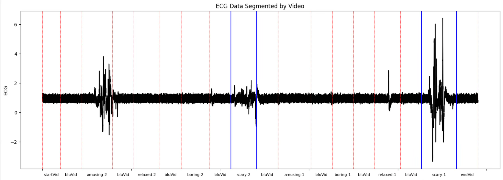

# CASE Data Preprocessing and Analysis

Analyzing how temporal spacing and interlude content between scary videos affects physiological responses (ECG and GSR).



## About

This project investigates how the **duration** and **arousal content** of intervals between fear-inducing stimuli influence physiological responses to subsequent exposures. Using the CASE dataset, we analyze changes in heart rate and galvanic skin response between two scary video presentations.

**Research Question:** How do the interlude duration and the proportion of low-arousal content between two scary videos affect the differences in physiological responses (ECG and GSR metrics)?

**Key Finding:** Spacing out scares works. Longer intervals between fear-inducing content lead to stronger physiological responses. The finding provides practical insight for pacing horror in films, games, and immersive experiences.

Presentation video: [ECG-GSR-Annotations-Video Visualization](https://youtu.be/-avJuYvJ5Aw)

## Paper
For detailed methodology and findings, see the [full report](CASE1_final_report.pdf).

## Dataset

This project uses the **Continuously Annotated Signals of Emotion (CASE)** dataset:

> Sharma, K., Castellini, C., van den Broek, E.L., Albu-Schaeffer, A., & Schwenker, F. (2019). A dataset of continuous affect annotations and physiological signals for emotion analysis. *Scientific Data*, 6(1), 196. https://doi.org/10.1038/s41597-019-0209-0

Download the dataset from: [Springer Nature Figshare](https://springernature.figshare.com/collections/A_dataset_of_continuous_affect_annotations_and_physiological_signals_for_emotion_analysis/4260668)

## Getting Started

### Prerequisites

Create a clean Python environment:

**Using Conda:**
```bash
conda create -n case1_project_env python
conda activate case1_project_env
```

**Using Python venv:**
```bash
python -m venv case1_project_env
```

Activate on Windows:
```bash
case1_project_env\Scripts\activate
```

Activate on Unix/MacOS:
```bash
source case1_project_env/bin/activate
```

### Installation

Clone the repository and install dependencies:

```bash
git clone https://github.com/ChristosP1/CASE_project.git
cd CASE_project
pip install -r requirements.txt
```

For the statistical analysis notebook with table of contents support:
```bash
pip install jupyter
jupyter notebook
```

### Data Setup

Move the CASE Full dataset into the same directory as the notebooks (or adjust the location in the first lines of each notebook).

> **Note:** The preprocessed files have already been created for convenience. If something goes wrong, delete the `preprocessed` folder and recreate everything. CPA takes >20 min, so use with caution.

### Running the Analysis

**1. Preprocessing**
- Open `case1_preprocessing.ipynb`
- Set `CPA = False` and run all cells
- Set `CPA = True` and run all cells again

**2. Statistical Analysis**
- Open `case1_statistical_analysis.ipynb`
- Set `CPA = False` and run all cells
- Set `CPA = True` and run all cells again

## Acknowledgments

Developed for the Advanced Quantitative Methods for HCI course at Utrecht University (2024).

Contributors:
- Emmanuel Fragkiadakis
- Christos Papageorgiou

Original repository: [github.com/ChristosP1/CASE_project](https://github.com/ChristosP1/CASE_project)
